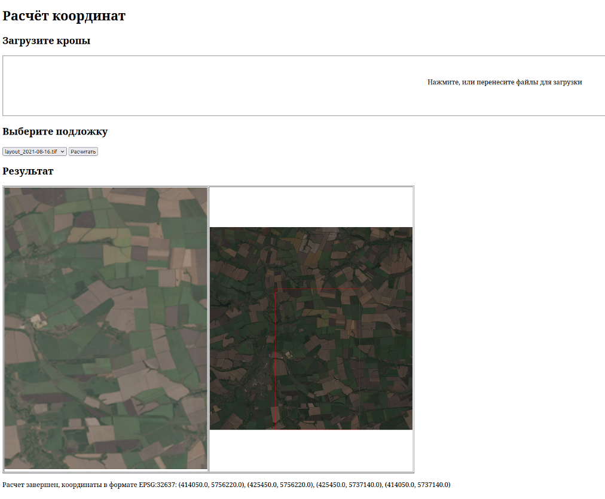

### 1. API (с помощью docker-compose)

### 2. Развертывание локально (с github):

2.1. Скачиваем репозиторий:
```sh
git clone https://github.com/grifon-239/Hack
```
2.2. Устанавливаем на компьютер среду Anaconda: можно с сайта по гайду https://docs.anaconda.com/free/anaconda/install/

2.3. Далее необходимо создать conda cреду с помощью команды: 
```sh
conda env create -f environment.yml
```
2.4. Активируем среду:
```sh
conda activate hack_env
```
2.5. Запуск скрипта осуществляется с помощью команды:
```sh
python3 main.py --crop_name path/to/crop.tif --layout_name path/to/layout.tif --path2save_coords path/to/save/results
```
	
 


